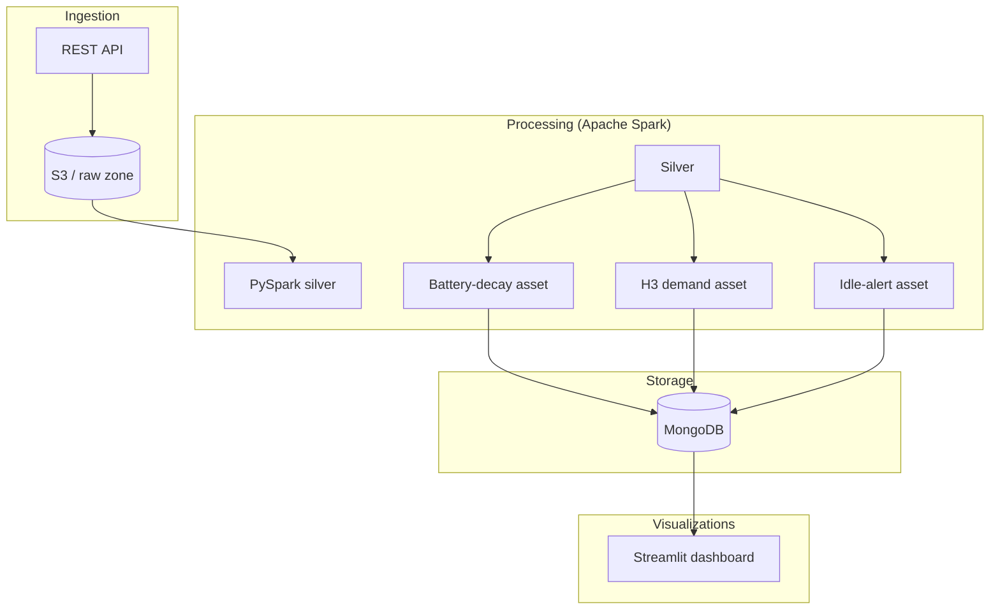

# 🛴 Moby Dublin – Telemetry Platform

> **An end‑to‑end data & analytics stack** that ingests real‑time scooter telemetry from the Moby fleet in Dublin, processes it with Apache Spark, schedules jobs with Dagster, stores aggregates as Parquet on AWS S3 and in MongoDB, and surfaces insights through a Streamlit dashboard.


## Table of Contents

1. [Features](#features)
2. [Architecture](#architecture)
3. [Quick Start](#quick-start)
4. [Configuration](#configuration)
5. [Running the Pipeline](#running-the-pipeline)
6. [License](#license)


## Features

| Layer | Highlights |
|-------|------------|
| **Ingestion** | Streaming telemetry → **S3 raw zone** via Spark Auto Loader. |
| **Processing** | Incremental PySpark assets compute KPIs: battery‑decay, demand hotspots (H3), idle‑bike alerts. |
| **Orchestration** | Dagster assets with hourly/daily sensors; local runs or CI triggers. |
| **Storage** | Parquet in AWS S3 **and** MongoDB collections for fast dashboard reads. |
| **Visualization** | Streamlit app with 3 tabs (map, line chart, alert table). |
| **CI/CD** | Pre‑commit, Ruff, Black; GitHub Actions placeholder for unit tests. |

### Tech Stack

- **Apache Spark 3.4** – distributed processing (local or YARN)
- **Python 3.10** – language for ETL, orchestration, and dashboard
- **Dagster 1.x** – declarative orchestration & asset lineage
- **MongoDB 7** – low‑latency serving layer for Streamlit
- **AWS S3** – scalable object store for raw & processed **Parquet**
- **Streamlit 1.33** (+ PyDeck / Plotly) – interactive telemetry dashboard

## Architecture



## Quick Start

> Prerequisites: **Python 3.10**, a running **MongoDB**, **Spark 3.4** (local), and optional AWS credentials if you want to copy Parquet to S3.

```bash
# 1) Clone & set up virtualenv
python -m venv .venv && source .venv/bin/activate
pip install -r requirements.txt

# 2) Configure environment (or copy .env.example)
export MONGO_URI="mongodb://localhost:27017/moby"
export AWS_ACCESS_KEY_ID=…          # only if writing to S3
export AWS_SECRET_ACCESS_KEY=…
export MAPBOX_TOKEN="pk.xxx"        # optional, nicer map tiles

# 3) Materialise an asset (example: demand hotspots)
poetry run dagster job run -m moby_pipeline.assets -j h3_demand_job

# 4) Launch Dagster UI (optional)
poetry run dagster dev  # http://localhost:3000

# 5) Start the dashboard
streamlit run dashboard.py          # http://localhost:8501
```


## Configuration

| Variable | Purpose |
|----------|---------|
| `MONGO_URI` | Mongo connection string (`mongodb://host:port/db`). |
| `AWS_ACCESS_KEY_ID` / `AWS_SECRET_ACCESS_KEY` | Credentials for writing Parquet to S3. |
| `MAPBOX_TOKEN` | Mapbox key for high‑resolution tiles (optional). |
| `SPARK_MASTER` | Override Spark master URL (defaults to `local[*]`). |

Environment variables are loaded at runtime via **python‑dotenv** – copy `.env.example` to `.env` and edit.


## Running the Pipeline

Using **Dagster**:

```bash
# Materialise a single asset
poetry run dagster job run -m moby_pipeline.assets -j battery_decay_job

# Or launch Dagster UI
poetry run dagster dev
```

## License

Released under the **MIT License**. See [LICENSE](LICENSE) for full text.


## 🙋‍♂️ Author

- **Joseph J.** – [GitHub Profile](https://github.com/JosephJ7)


## 📬 Contact

For feedback, issues, or suggestions:  
📧 josephjacobie2001@gmail.com  
📁 Or create an [issue](https://github.com/JosephJ7/crimedetection-AYS/issues)