# 🛴 Moby Dublin – Telemetry Platform

> **An end‑to‑end data & analytics stack** that ingests real‑time scooter telemetry from the Moby fleet in Dublin, processes it with Apache Spark, schedules jobs with Dagster, stores aggregates as Parquet on AWS S3 and in MongoDB, and surfaces insights through a Streamlit dashboard.


## Table of Contents

1. [Features](#features)
2. [Architecture](#architecture)
3. [Quick Start](#quickstart)
4. [Configuration](#-configuration)
5. [Running the App](#-running-the-app)
6. [License](#license)


## Features

| Layer | Highlights |
|-------|------------|
| **Ingestion** | Streaming telemetry → **S3 raw zone** via Spark Auto Loader. |
| **Processing** | Incremental PySpark assets compute KPIs: battery‑decay, demand hotspots (H3), idle‑bike alerts. |
| **Orchestration** | Dagster assets with hourly/daily sensors; local runs or CI triggers. |
| **Storage** | Parquet in AWS S3 **and** MongoDB collections for fast dashboard reads. |
| **Visualization** | Streamlit app with 3 tabs (map, line chart, alert table). |
| **CI/CD** | Pre‑commit, Ruff, Black; GitHub Actions placeholder for unit tests. |

### Tech Stack

- **Apache Spark 3.4** – distributed processing (local or YARN)
- **Python 3.10** – language for ETL, orchestration, and dashboard
- **Dagster 1.10** – declarative orchestration & asset lineage
- **MongoDB 7** – low‑latency serving layer for Streamlit
- **AWS S3** – scalable object store for raw & processed **Parquet**
- **Streamlit 1.33** (+ PyDeck / Plotly) – interactive telemetry dashboard

## Architecture

```mermaid
flowchart TD
  %% Ingestion layer
  subgraph Ingestion ["Ingestion"]
    API[REST API] --> S3raw[(S3 / raw zone)]
  end

  %% Processing layer
  subgraph Processing ["Processing (Apache Spark)"]
    S3raw --> Silver[PySpark silver]
    Silver --> Battery[Battery‑decay asset]
    Silver --> Demand[H3 demand asset]
    Silver --> Idle[Idle‑alert asset]
  end

  %% Storage layer
  subgraph Storage ["Storage"]
    Battery & Demand & Idle --> Mongo[(MongoDB)]
  end

  %% Visualizations layer
  subgraph Visualizations ["Visualizations"]
    Mongo --> Streamlit[Streamlit dashboard]
  end
```



## Quick Start

> Prerequisites: **Python 3.10**, a running **MongoDB**, **Spark 3.4** (local), and optional AWS credentials if you want to copy Parquet to S3.


1. Clone the repository:
```bash
git clone https://github.com/<your-username>/diss-project.git
```
2. Navigate to the project directory:
```bash
cd diss-project
```
3. Create a virtual environment (Python 3.10)
```bash
# Create virtual environment using Python 3.10
python3 -m venv .venv
```
4. Activate the virtual environment
- On macOS/Linux:

  ```bash
  source .venv/bin/activate
  ```
- On Windows:

  ```bash
  .venv\Scripts\activate
  ```
5. Install the required packages:
```bash
pip install -r requirements.txt
```
## 🧰 Configuration

Create a file `config.py` and ensure your file is placed inside the first moby_pipeline folder and check the correct  MongoDB configuration :

```python
S3_BUCKET = <s3-bucket-name>
MONGO_URI = <your-mongoDB-connection-string> 
SPARK_HOME  = r"C:\spark\spark-3.5.5-bin-hadoop3"            
MAX_RANGE_M = 45000                 
```
| Variable | Purpose |
|----------|---------|
| `S3_BUCKET` | Name of your AWS S3 bucket where raw and processed Parquet files are stored. |
| `MONGO_URI` | Mongo connection string (`mongodb://host:port/db`). |
| `SPARK_HOME` | Local path to your Spark installation for Windows (e.g., `C:\\spark\\spark-3.5.5-bin-hadoop3`). |
| `MAX_RANGE_M` | Maximum theoretical scooter range in metres (used for battery-decay KPI).. |
| `AWS_ACCESS_KEY_ID` / `AWS_SECRET_ACCESS_KEY` | Credentials for writing Parquet to S3. |

## 🧪 Running the App

### 1. Start the Streamlit Dashboard
```bash
streamlit run .\moby_pipeline\dashboard.py
```

### 2. Run the Dagster Pipeline (manually)
#### To run the pipeline manually:
```bash
dagster job execute -f moby_pipeline/assets.py -j full_pipeline
```
#### To run the pipeline from Dagster UI:
Start the processor on one terminal.
```bash
dagster-daemon run
```
On the other terminal , start the Dagster UI using this command:
```bash
dagster-webserver
```

## License

This project is licensed under the [Creative Commons Attribution 4.0 International License (CC BY 4.0)](https://creativecommons.org/licenses/by/4.0/).

## 🙋‍♂️ Author

- **Joseph J.** – [GitHub Profile](https://github.com/JosephJ7)

## 📬 Contact

For feedback, issues, or suggestions:  
📧 josephjacobie2001@gmail.com  
📁 Or create an [issue](https://github.com/JosephJ7/crimedetection-AYS/issues)